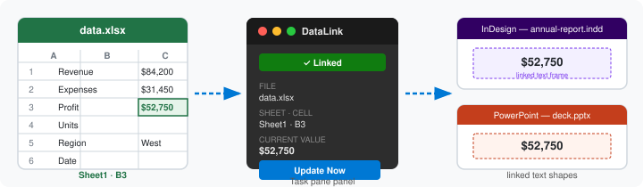
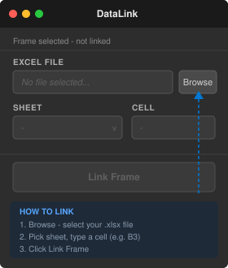

# DataLink

DataLink links text frames in Adobe InDesign and text shapes in Microsoft PowerPoint to individual cells in a local Excel (`.xlsx`) file. When the Excel data changes, the linked text updates automatically — with no visible tokens, underlines, or formatting changes in the documents.



## Features

- Link InDesign text frames or PowerPoint text shapes to Excel cells
- Auto-update when returning to the application
- Number formatting from Excel is preserved (currency, percentages, dates)
- Highlight mode shows all linked items with a semi-transparent overlay
- All link metadata stored invisibly inside the document (no external files)

## Requirements

| Requirement | Details |
|---|---|
| **Node.js 16+** | Build tool and local server — [nodejs.org](https://nodejs.org) |
| **Adobe InDesign CC 2021+** | UXP API 6.0+ required |
| **Microsoft PowerPoint** | **Windows desktop only** (Microsoft 365, Office 2019+). The add-in uses `DesktopRuntime` and cannot run in PowerPoint for Mac or PowerPoint Online. |

---

## Installation

### One command — all platforms

Make sure [Node.js 16+](https://nodejs.org) is installed, then run **one of the following** from inside the project folder:

| Platform | Command |
|---|---|
| Any terminal (Windows / macOS / Linux) | `node setup.js` |
| npm shorthand | `npm run setup` |
| Windows — double-click | `install.bat` |

That's it. No admin rights, no extra tools.

**What it does:**

1. Verifies Node.js 16+
2. Runs `npm install` and builds both plugins
3. **Windows:** copies the manifest to `%APPDATA%\Microsoft\Office\16\Wef\` and adds a silent server launcher to the Startup folder (so the server runs automatically at every login) plus a Desktop shortcut
4. **macOS:** installs a launchd user agent (`~/Library/LaunchAgents/com.datalink.server.plist`) — auto-starts the server at every login
5. Starts the local server immediately on `http://localhost:3000`
6. Prints the exact path to select when loading the InDesign plugin

> **PowerPoint is Windows desktop only.** The add-in uses `DesktopRuntime` and cannot run in PowerPoint for Mac or PowerPoint Online. On macOS, only the InDesign plugin is usable.

---

## First Use After Installation

### Panel UI

<table>
<tr>
<td align="center"><strong>Select a frame → choose a cell → click Link</strong></td>
<td align="center"><strong>Frame is linked — update, repoint, or remove</strong></td>
</tr>
<tr>
<td></td>
<td></td>
</tr>
</table>

The same panel appears in both InDesign and PowerPoint.

---

### InDesign (Windows and macOS)

Loading the plugin via UXP Developer Tools is a **one-time manual step**:

1. Open InDesign CC 2021+
2. Go to **Plugins → UXP Developer Tools**
3. Click **Load Plugin**
4. Navigate to and select `indesign-plugin/manifest.json`
5. The **DataLink** panel will appear in your panels list

> To use the plugin in future sessions, repeat steps 2–4, or keep UXP Developer Tools open. The plugin does not auto-load between application relaunches when loaded this way.

### PowerPoint (Windows only)

The DataLink server (`http://localhost:3000`) must be running before you open PowerPoint.

- **Automatic (after running `install.ps1`):** The server starts silently at every Windows login.
- **Manual start:** Double-click **"Start DataLink Server"** on your Desktop, or run:
  ```
  node powerpoint-addin/serve.js
  ```
- **If port 3000 is in use by another app:**
  ```
  PORT=3001 node powerpoint-addin/serve.js
  ```
  Then edit `manifest.xml` to replace `localhost:3000` with `localhost:3001` before re-copying it.

To open the add-in in PowerPoint: **Insert → My Add-ins → DataLink**

---

## Developer Build Reference

```bash
# Install all dependencies (run once, or after pulling changes)
npm install

# Build both plugins
npm run build

# Build individually
npm run build:indesign    # → indesign-plugin/dist/bundle.js
npm run build:powerpoint  # → powerpoint-addin/dist/taskpane.bundle.js

# Watch mode (rebuilds on file save)
npm run dev --workspace=indesign-plugin
npm run dev --workspace=powerpoint-addin

# Run shared module tests (14 assertions, no framework)
npm test

# Start the PowerPoint server manually
node powerpoint-addin/serve.js
```

---

## Uninstall

**Windows:**

| What | How |
|---|---|
| Stop server auto-start | Delete `%APPDATA%\Microsoft\Windows\Start Menu\Programs\Startup\DataLink-Server.vbs` |
| Remove PowerPoint add-in | Delete `%APPDATA%\Microsoft\Office\16\Wef\DataLink.xml` |
| Remove Desktop shortcut | Delete `%USERPROFILE%\Desktop\Start DataLink Server.lnk` |
| Remove InDesign plugin | Plugins → UXP Developer Tools → unload DataLink |

**macOS:**

```bash
launchctl unload ~/Library/LaunchAgents/com.datalink.server.plist
rm ~/Library/LaunchAgents/com.datalink.server.plist
```

Then unload the InDesign plugin from Plugins → UXP Developer Tools.

---

## Project Structure

See `CLAUDE.md` for the full technical specification and architecture.
